# Linux 网络环境配置

## Linux 远程服务器

### 通过跳板机访问内网服务器

本地机器的配置详见下面的文件：

注意**跳板机 IP 地址**和**服务器 IP 地址**不一样，跳板机作用是让本地机器访问内网，因此配置 VPN 这里需要填入**跳板机的 IP 地址**。预共享密钥和密码不是同一个东西，这里我的预共享密钥是 lab505，用户名是 zkyh，密码是 ac3bdf92。密码用于服务器的登录等。

连接上 vpn 后，用终端连接服务器，这里推进 vscode 的 Remote-SSH 插件，接下来也基于该插件讲解。

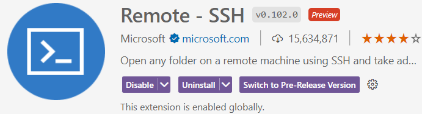

初次连接时，会要求配置 config 文件，在目录 `C:\Users\用户名\.ssh` 下，其内容如下：

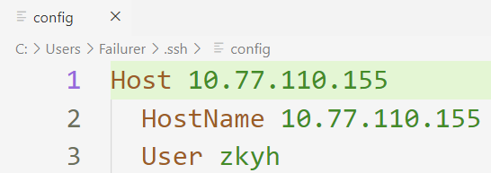

Host 和 HostName 都配置成**服务器的 IP 地址，**User 就是用户名 zkyh。选择服务器系统 linux，配置完后完成连接。

### ssh 免密登录

假设需要使用 Windows 客户机 A 免密登录远程 Linux 服务器 B，其本质就是在 A 上生成 rsa 公私钥对，将公钥添加到服务器 B 上即可。

生成公私钥：

```bash
ssh-keygen -t rsa -C "1536454795@qq.com"
```

与后面 git 内容保持一致，一般用邮箱进行注释，执行命令后需要进行 3 次或 4 次确认：

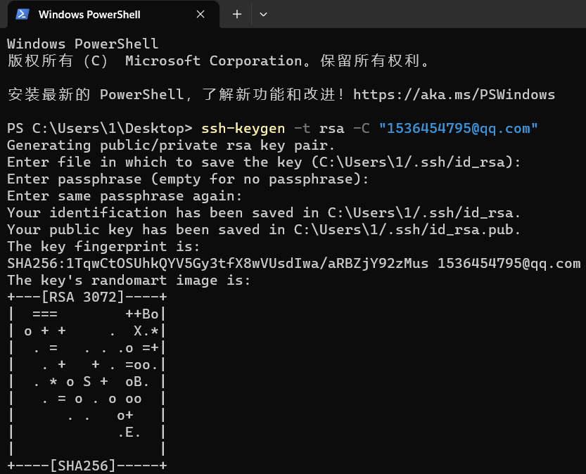

在 B 的~/.ssh/目录下输入命令：

```bash
# ID_RSA.PUB是A上的公钥id_rsa.pub的内容，将该内容追加进文件authorized_keys（没有该文件会新建）
echo "ID_RSA.PUB" >> authorized_keys
echo "ssh-rsa AAAAB3NzaC1yc2EAAAADAQABAAABgQCoJkMyoTQ58Bn9EXzzesPI9GCifSwhoJy+wzsrG7hGqQ1FtdZ/kzxWypO5rbmp7MNb7LP/01bINI/I1n2bF6N6eA0tJglN9i100t21TsmfuWe6X+FyTj7qyLX2rpeAa3O6n+XoklGtMsIZATMx8Jw4LPZYEq46I9l191kt/QSO6eNE3U+KLhvFXAzS/6Ok8ay9Qo4JXTaUjJCocTCMHpZsq1rw8OMowQUAtKyjRMZvHPg5QLyGAypAWWIn6yNH1aiU4OyyOJjOD8u3gg/44dqbFiiV7JT++zM7JwHD4HlkoO0/5D6n8NPI+PMtXcfTDHVjAekj44KaomIoYpG2vqMGUztyI46qQGmJGC/RZTtMDjZMB6l+i1ZlZ4Wck/hIZiiuzHaWnXBZBsNgfxKdOPWQYRx1rtl8awHICvd2XFteFw8xyzHHrH9SqZwSYM5ImuJWLxwPzMKZsVmRvQ50ICKfOYjjHyl60m5PUV8S7d1BzT1uMOPJqPpEHf4PfoA75rU= 1536454795@qq.com"  >> authorized_keys
```

### 文件传输

文件传输有许多方法，如果本地机器有图形化界面，推荐使用 vscode 进行传输，否则还是基于 ssh 加密的两种方法：`scp` 和 `sftp`。本次 terminal 中的命令示例都是基于本地服务器 Windows 和远程服务器为 Linux 的情况，可以从命令中路径的间隔符判别是 Windows 的路径还是 Linux 的路径（Windows 是反斜杠 `\`，Linux 是正斜杠 `/`）。所有 terminal 的命令都是在 Windows 上发起的，因此 Windows 路径都是相对 terminal 工作目录的，而 Linux 则是相对用户目录 `~` 的。

指定远程 Linux 服务器都会使用**< 用户名 >@<IP 地址 >**的形式，本小节遵循该方式。

本小节分大文件和小文件的传输讨论传输手段，由于内网穿透原因，大文件的传输可能不稳定。如何界定大文件和小文件本身是一件模糊的事情，这里经过本人的实验，小于等于 512MB 的文件是可以通过 scp 稳定传输的 ，因此认为是小文件，大于 512MB 的文件传输不稳定，认为是大文件。**注意大文件小文件的界定是根据网络情况来的**，如果没有内网穿透可能不存在传输不稳定问题。

#### 小文件的传输

文件传输建立在上述 **ssh 免密登录**的前提下，使用 scp 命令进行文件的拷贝：

```bash
**scp** -r file zkyh@10.77.110.155:upload/
```

- `file` 代表待上传的文件或文件夹
- `-r` 代表允许传输文件夹
- `zkyh` 代表用户名
- `10.77.110.155` 代表服务器 IP 地址
- `upload` 代表相对于 `~` 的上传位置（目标路径）

相应地，将服务器上的文件（夹）下载至本机即可使用下面的命令：

```bash
**scp** -r zkyh@10.77.110.155:file download\
```

- `file` 代表相对于 `~` 的待下载文件（夹）
- `-r` 代表允许传输文件夹
- `zkyh` 代表用户名
- `10.77.110.155` 代表服务器 IP 地址
- `.\download` 代表下载到本机的目录

#### 大文件的传输

大文件的传输推荐使用 sftp 命令（没有试过 scp，应该也可以），需要先建立 sftp 连接，再使用 put 和 get 方法进行文件的传输：

```bash
# 建立sftp连接
**sftp** zkyh@10.77.110.155
# 使用put上传文件，上传file到Linux的upload目录
**put** -r file upload/
# 使用get下载文件，下载file到Windows的download目录
**get** -r file download\
```

值得注意的是 sftp 是支持断点续传的，因此网络不稳定，出现 broken pipe 的错误也没有问题，只需要重新建立 sftp 连接，使用 reput/reget 命令即可：

```bash
# 建立sftp连接
**sftp** zkyh@10.77.110.155
# 使用reput实现断点续传
**reput** -r file upload/
```

可以看下面的示例：

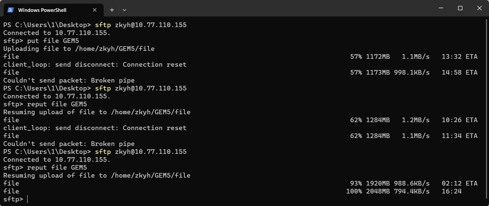

#### vscode 直接拖拽

直接基于 GUI 的方式将文件（可以是大文件）拖入已经建立 ssh 连接的 vscode 文件导航栏中，vscode 会在后台完成复制。这种方式似乎只能由客户端向服务端上传文件/文件夹，但是连接比较稳定。

#### 文件暂存网站

国内国外有许多提供文件暂存服务的网站，这是一个文件传输的很好的中转站，其对于拥有图形化界面拥有浏览器的 Linux 系统比较方便，但是若没有图形化界面，似乎不可用：因为这些网站的上传下载都是基于 javascript 的，需要自行写请求体。至于能否使用 curl、wget 等下载工具去下载还有待研究。

### 使用 vscode 进行服务器端开发

除了上述使用 vscode 连接远程服务器，vscode 还可以进行服务器端的开发，只需要在服务器端安装插件即可：

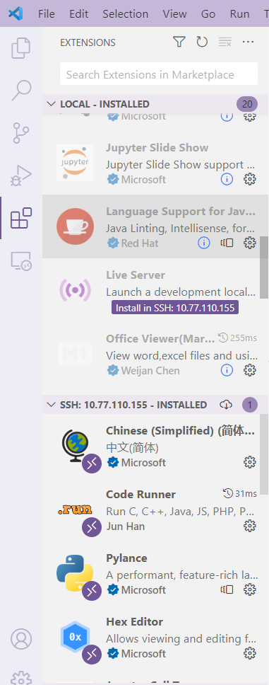

上述图中的 `LOCAL-INSTALLED` 表示的是本地的插件，可以点击 `Install in SSH：10.77.110.155` 安装到服务器端，这样在下面的 `SSH：10.77.110.155-INSTALLED` 能够显示。

ssh 连接后，vscode 的插件的运算负载就会被放在服务器上而不是本地，甚至 vscode 本身的一些功能，比如左侧栏的全局替换和全局搜索，负责实际去计算的也是服务器。

## 曲线“翻墙”

此处的“翻墙”主要是指访问 github 和 google，而此处的“曲线救国”是指在目标机器不配置代理的情况下，如何拿到上述两者的资源。但是如果需要访问墙外的资源，无论如何还是需要“翻墙”，只不过是直接和间接的区别。

### gitee 中转

对于 github 的仓库，其实很简单可以通过 gitee 进行转存，可以直接用 url 转存，也可以 gitee 绑定 github 账号，先用 github 账号 fork 之后再转存。这样做的好处就是目标机器会比较干净，且基于图像界面的操作虽然繁琐却比较简单。缺点就是在编译某些仓库时，会有许多依赖项需要去 github 上拉取，如果手动一个一个转存会非常花时间。

gitee 还可以看作一个中转站，不仅仅可以用于中转代码，还可以用于中转编译后的 obj，普通文件等等。但是其一次 push 的大小有限制，仓库的大小也有限制。

### 修改 hosts 访问 github

国内无法访问 github 的原因主要是 DNS 污染，可以通过使用工具查询 github 网站正确 IP，修改 hosts 文件实现访问 github。

首先使用 [IP 查询工具](https://tool.chinaz.com/dns)分别查询下面两个域名的 IP 地址：

```bash
# 适用于 https方式的克隆
github.com
github.global.ssl.fastly.net
```

查询得到地址后，修改 hosts 文件：

```bash
# Linux的 hosts文件目录
/etc/hosts
# Windows的 hosts文件目录
C:\Windows\System32\drivers\etc\hosts
```

在本机环回地址 localhost 后面添加上述的两个域名以及其 IP（需要管理员权限，linux 下使用 sudo vim 进行编辑）：

```
127.0.0.1       localhost
**20.205.243.166  github.com**
**199.96.58.15    github.global.ssl.fastly.net**
```

修改后刷新 DNS 缓存：

```bash
# Ubuntu下
sudo /etc/init.d/dns-clean start
# Windows Terminal下
ipconfig /flushdns
```

注意，上述手动方式修改 hosts 的方法虽然简单干净，但是由于 IP 地址时常发生变化，上述修改过一段时间后就容易失效，需要重新手动修改，会比较麻烦。网上会有一些[自动刷新的脚本](https://blog.csdn.net/e_00c/article/details/83618559?ydreferer=aHR0cHM6Ly93d3cuZ29vZ2xlLmNvbS8%3D)可以参考，但本人没有试过。

### 虚拟机流量转发

如果是使用的虚拟机，则可以让 [Host 机转发虚拟机的流量](http://lihuaxi.xjx100.cn/news/78969.html?action=onClick)，如果 Host 机可以访问外网，则虚拟机也可以访问外网。

本质上是使用 Clash For Windows 等代理软件的“Allow LAN”功能，因在 Windows 上配置代理相比 Linux 要简单得多：

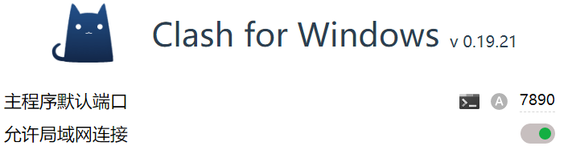

打开上述功能，同时可以看到代理端口是 7890，现找到虚拟机的 IP 地址，输入 win+r，打开 cmd，输入 ipconfig

找到 `VMware Network Adapter VMnet8`（默认使用 VMware 配置虚拟机，且网络方面是默认配置），其中 IPv4 的地址就是虚拟机的 IP 地址：

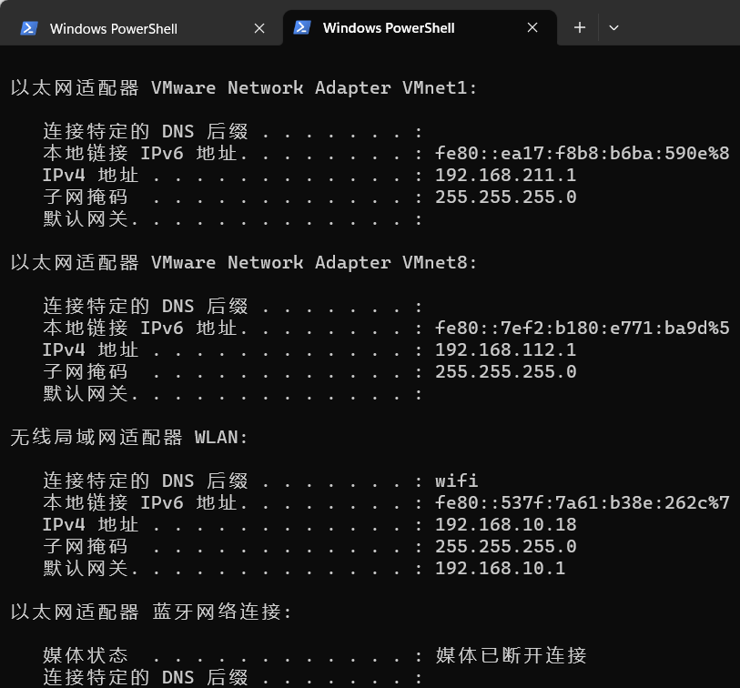

进入 Ubuntu（其他 Linux 发行版应该也是类似的流程），打开**设置-> 网络设置-> 网络代理**（不同系统名字会有些许差异，但大体意思都一样，就是代理的意思，**注意不是****VPN****，是代理！！！**），然后手动添加 HTTP 和 HTTPS 代理，IP 地址和端口如上所述：

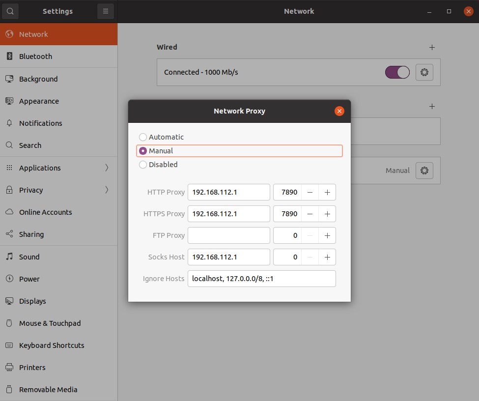

上述操作可以在 Chrome 等浏览器中可以访问外网，但有时需要终端走代理（如 pip、apt-get、yum 等），这时针对需要走代理的用户做如下设置：

```bash
export http_proxy='http://192.168.112.1:7890'
export https_proxy='http://192.168.112.1:7890'
export ALLOW_PROXY='http://192.168.112.1:7890'
```

如果只在 terminal 输入上述结果，只会当前 terminal 生效，需要永久生效则需要写入 `~/.bashrc` 文件中

```bash
vim ~/.bashrc
# 输入下面内容，使用wq保存退出
# export http_proxy='http://192.168.112.1:7890'
# export https_proxy='http://192.168.112.1:7890'
# 使立即生效
source ~/.bashrc
```

## 配置代理

配置代理需要首先订阅机场链接；使用的代理软件是 [clash](https://github.com/Dreamacro/clash) 的 linux 版本，并且整合 clash 的 GUI 组件 [yacd](https://github.com/haishanh/yacd)（ClashDashboard），具体的信息可以自行查看 github 仓库 [clash-for-linux](https://github.com/wanhebin/clash-for-linux)。

这里以阿里云 ECS 服务器为例，介绍如何为远程服务器配置代理。

### 基本使用

克隆仓库：

```bash
# 可以访问github使用下面的链接
git clone https://github.com/wanhebin/clash-for-linux.git
# 无法访问github使用本人公开的仓库
git clone https://gitee.com/failurejack/clash-for-linux.git
cd clash-for-linux
vim .env
sudo bash start.sh

$ source /etc/profile.d/clash.sh
$ proxy_on

netstat -tln | grep -E '9090|789.'
tcp6       0      0 :::9090                 :::*                    LISTEN     
tcp6       0      0 :::7891                 :::*                    LISTEN     
tcp6       0      0 :::7890                 :::*                    LISTEN     
tcp6       0      0 :::7892                 :::*                    LISTEN 
env | grep -E 'http_proxy|https_proxy'
https_proxy=http://127.0.0.1:7890
http_proxy=http://127.0.0.1:7890

http://47.120.34.224:9090/ui
http://127.0.0.1:9090/ui

sudo bash shutdown.sh

proxy_off

sudo ufw enable
sudo ufw allow 9090/tcp
sudo ufw delete allow 9090/tcp
sudo ufw status
sudo ufw disable
```

设置订阅链接和密码：

```bash
cd clash-for-linux
vim .env
```

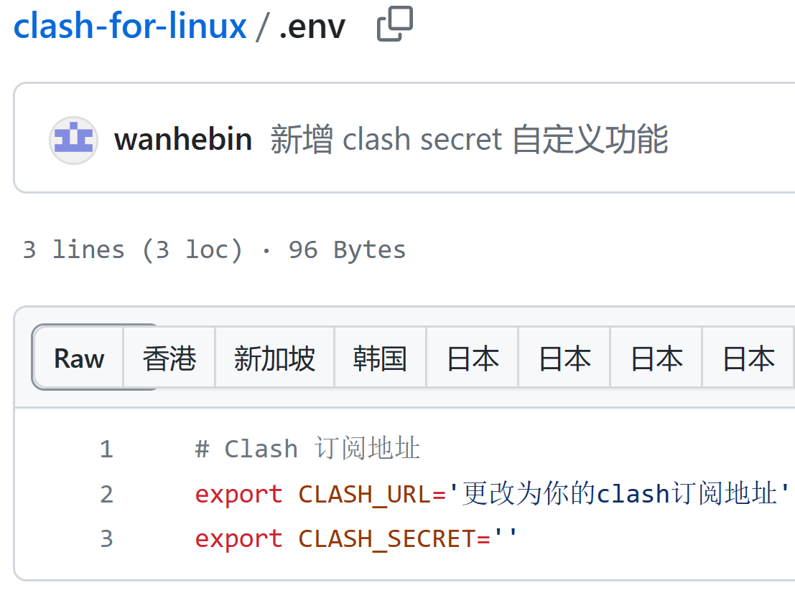

CLASH_URL 处粘贴为你个人的订阅地址，CLASH_SECRET 处写上 ClashDashboard 的登录密码，如何此处为空，将随机生成字符串，并在后面的启动中打印到控制台。

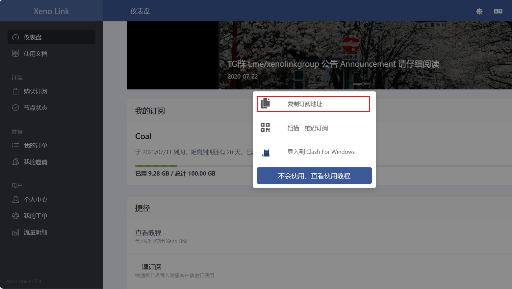

启动 clash-for-linux

```bash
# 这里确保要使用 sudo 和 bash 执行
sudo bash start.sh
```

正常情况下终端打印如下：

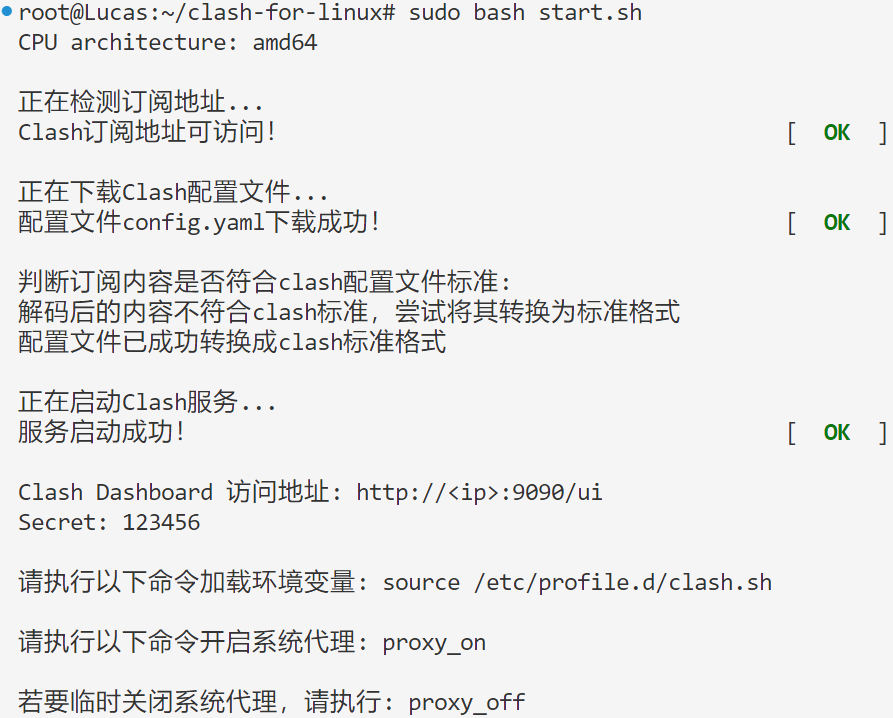

可以看到 GUI 的密码和地址在控制台中被打印出来，有关 Dashboard 的问题，将在下一小节**“GUI 配置”**叙述。

先查看各种服务进程是否已经启动：

```bash
netstat -tln | grep -E '9090|789.'
```

正常情况结果如下：

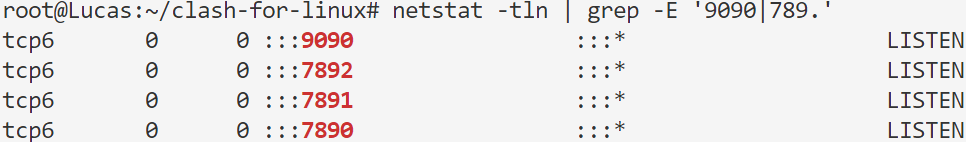

上述四个端口号代表的进程都启动时，证明连接已经建立，此时只需要将流量代理到 `http://127.0.0.1:7890` 即可。由于在远程服务器上主要使用 terminal 工作，因此这里介绍如何在在 terminal 中开启代理。

与**“****虚拟机****流量转发”**章节中类似，在 terminal 代理流量分为暂时性代理和永久代理。暂时性代理只会在当前 terminal 生效，新建或切换为其他 terminal 都无效，具体方法就是输入如下代理命令：

```bash
export http_proxy='http://127.0.0.1:7890'
export https_proxy='http://127.0.0.1:7890'
```

永久生效就是将上述内容写入 `~/.bashrc` 文件末尾。

然而，有时候需要频繁开关代理，因此 clash-for-linux 采用了更为方便的方法（其实就是写了 shell 脚本）：

```bash
# 加载环境变量
source /etc/profile.d/clash.sh
# 开启代理
proxy_on
# 查看环境变量中的代理
env | grep -E 'http_proxy|https_proxy'
```

即加载 `/etc/profile.d/clash.sh` 脚本文件中所设置的环境变量，以便在当前 shell 会话中使用。这个文件定义了 proxy_on 和 proxy_off 两个函数供调用，可以方便地开关代理（注意是当前 terminal 生效）。正常情况输出如下：

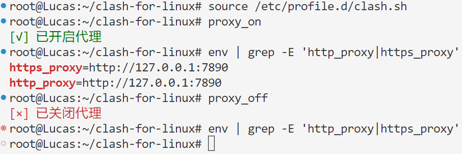

如果换了 terminal，只需要输入命令 `source /etc/profile.d/clash.sh` 即可正常使用。此时可以科学上网：

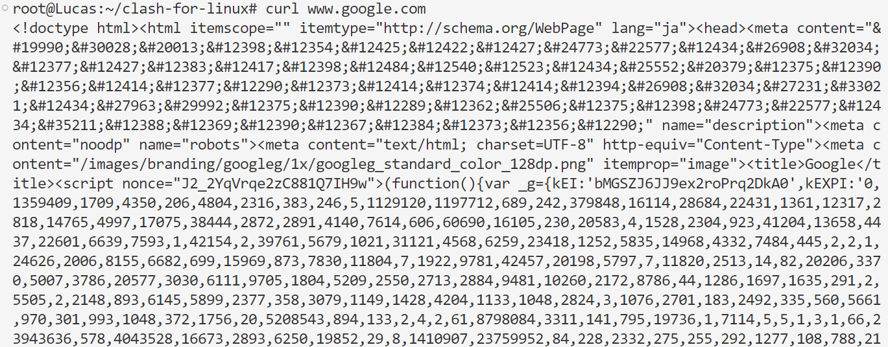

由于服务器重启次数较少，因此 clash 的四个进程可以保持开启，若是重启了服务器，重启该进程即可（代理进程一般也没多重要），没必要配置开机启动、守护进程等。这简单介绍一下服务的关闭：

```bash
# 这里确保要使用 sudo 和 bash 执行，**注意一定是shutdown.sh而不是shutdown，shutdown是关机**
sudo bash shutdown.sh
```

### GUI 配置

上述命令行的配置是通用的，一般而言配置成功后机场会自动选择节点，可以正常科学上网。但是想要切换节点或者其他方面的应用则需要配置 GUI。

#### Clash Dashboard

上述启动的四个 clash 的进程中，端口号为 9090 的是 Dashboard 的进程：

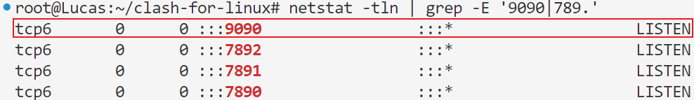

如果本机有 GUI 界面，则直接打开浏览器，输入地址 `http://127.0.0.1:9090/ui` 访问 Dashboard：

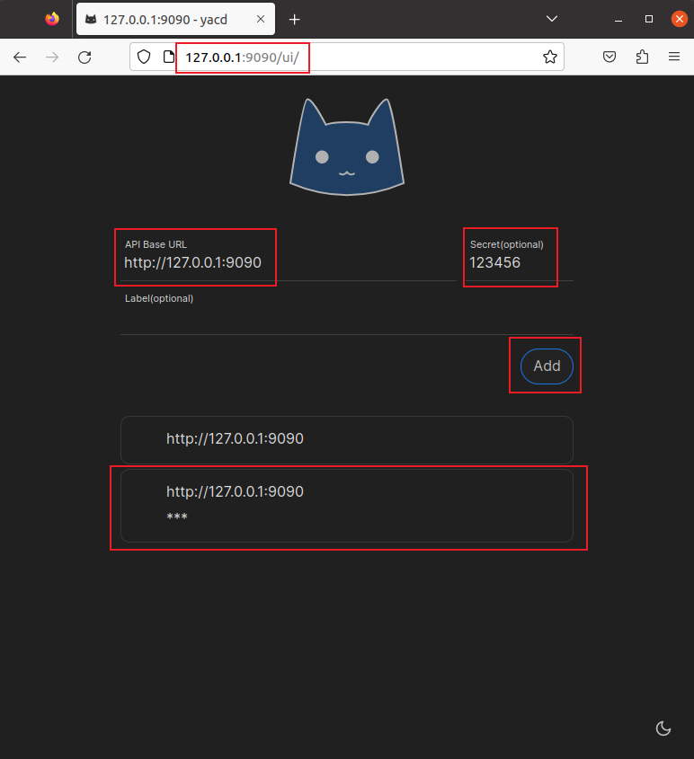

这里的 `API Base URL` 输入：`http://127.0.0.1:9090`，`Secret` 输入之前打印在 terminal 中的内容，我这里是 `123456`，点击 Add，会在下方新增一个带有*的区块，点击该区块进入控制界面：

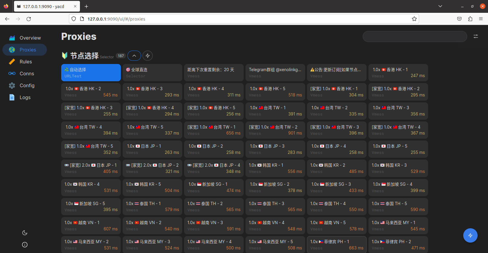

点击 Proxies 即可切换节点，点击菜单栏的其他选项可以进行更高级的配置。如果是没有图形化界面的服务器，则需要远程访问部署在服务器上的网站（需要公网 IP）。

首先启动了 9090 端口的进程后，需要服务器的防火墙放行。一般云服务器厂商不会配置放行 9090 端口，需要自行设置，或者直接关闭防火墙：

```bash
sudo ufw disable
```

此时可以仅靠阿里云 ECS 的安全组实现流量控制，但是终归安全性不是那么高，因此下面介绍如何配置防火墙：

```bash
# 先开启防火墙
sudo ufw enable
# 可以先看一下防火墙通过列表，查看是否允许9090端口通过
sudo ufw status
# 没有则允许9090端口建立tcp连接
sudo ufw allow 9090/tcp

# 可以删除已经配置的通过
# sudo ufw delete allow 9090/tcp
```

此时完成服务器防火墙的配置，还需配置 ECS 安全组。

阿里云 ECS 在防火墙的基础上设置了一层虚拟防火墙，即 ECS 的安全组，需要配置放行 9090 端口。

进入 ECS 控制台：[https://www.aliyun.com/product/ecs](https://www.aliyun.com/product/ecs)

点击进入目标服务器的管理界面：

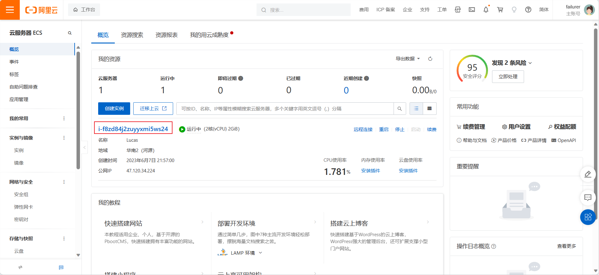

切换到安全组选项卡，点击配置规则：

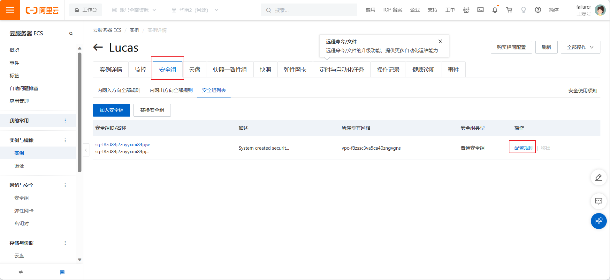

ECS 默认出方向无需配置，能够从 ECS 服务器转发所有流量包，需要配置进入服务器的流量，即入方向：

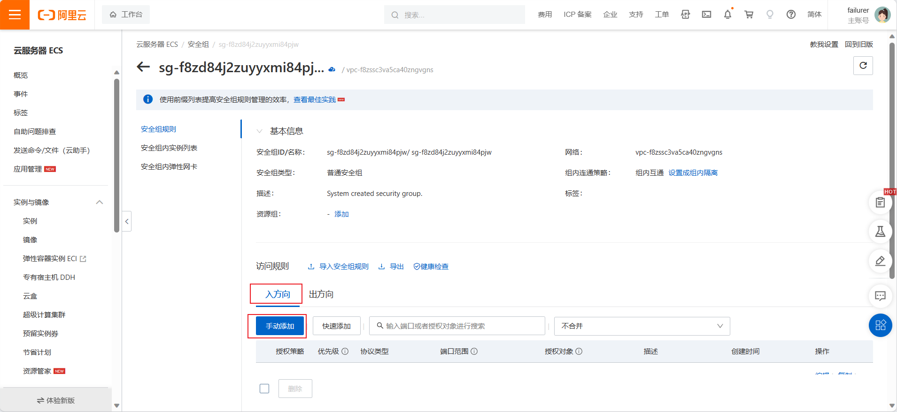

添加规则如下，注意端口范围手动输入 9090，授权对象为 0.0.0.0/0 允许任何 IP 访问，其他默认即可，点击保存。

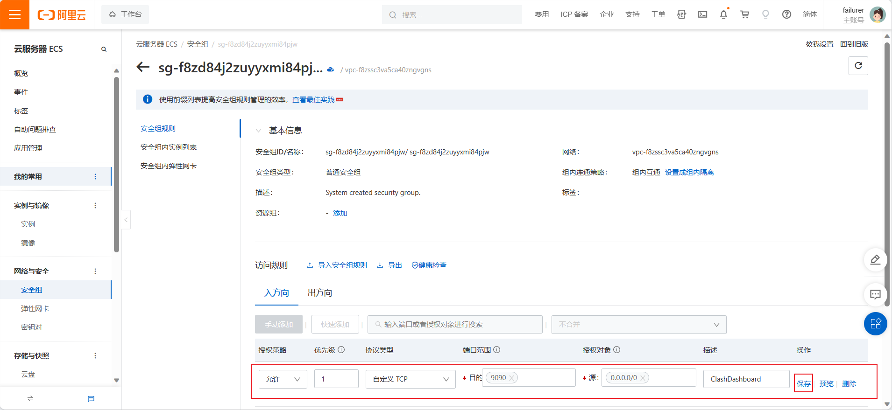

至此可以顺利访问 Dashboard。此时 IP 换成服务器公网 IP，使用浏览器访问 `http://47.120.34.224:9090/ui`，注意 IP 的不同，其他的操作跟本机上的操作一样。

#### 浏览器

配置浏览器的代理（也许可以在.bashrc 配置全局代理），这里以 Ubuntu 桌面版预装的火狐浏览器为例，打开火狐浏览器的设置，搜索 proxy，点击 Network Settings 中的 Settings 按钮：

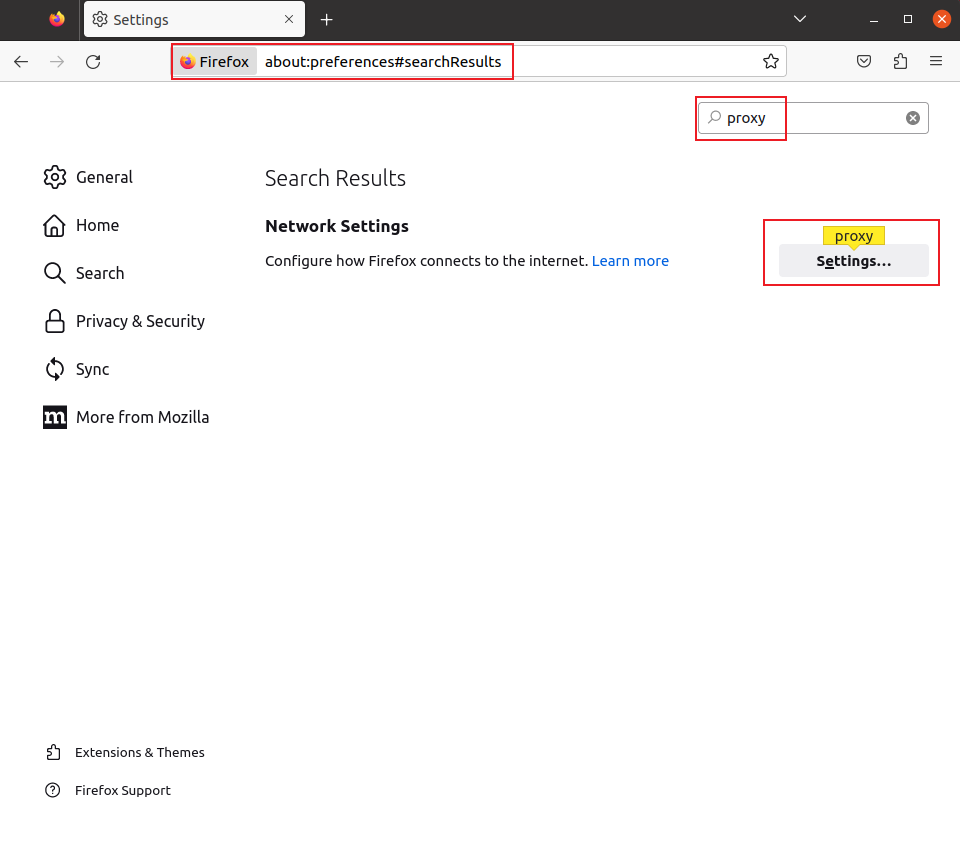

进入之后，勾选 Manual proxy configuration，HTTP Proxy 输入本机回环地址 127.0.0.1，端口为 7890，勾选 Also use this proxy for HTTPS，点击 OK 即可：

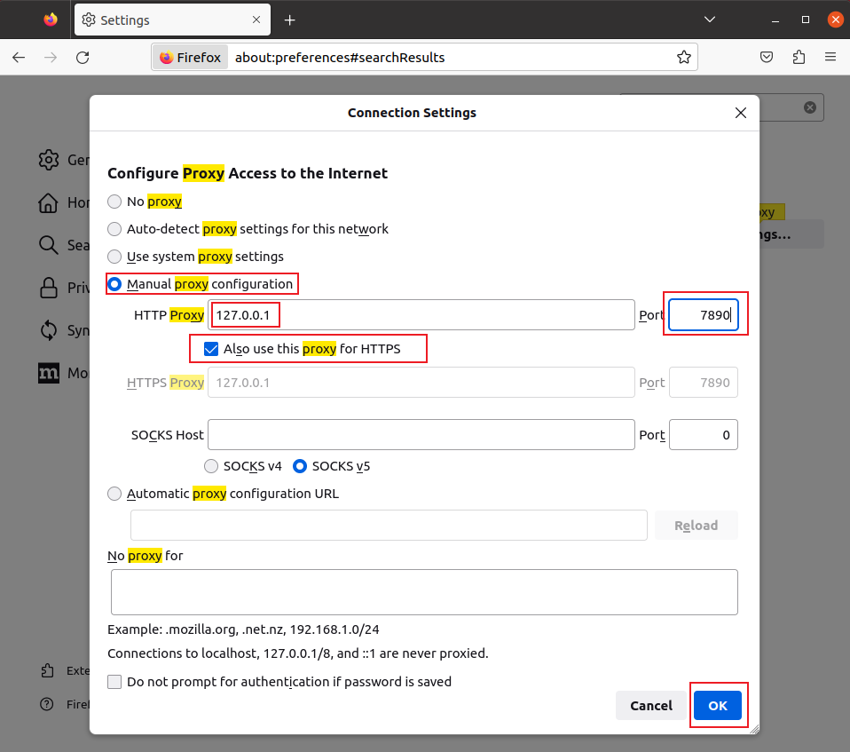

至此可以通过浏览器科学上网。

## 内网穿透

[https://blog.csdn.net/m0_63969219/article/details/125019967](https://blog.csdn.net/m0_63969219/article/details/125019967)

## 其他网络问题

### 虚拟机“掉网”

有时候虚拟机会在某次开启后，无法连接互联网，这个现象我个人称之为“掉网”，从经验的角度来看，出现了一次“掉网”后频繁发生。原因未明，重新安装虚拟机可能永久解决这一现象，暂时解决可以允许下面的脚本：

```bash
#!/bin/bash
sudo service network-manager stop
sudo cp /var/lib/NetworkManager/NetworkManager.state  /var/lib/NetworkManager/NetworkManager.state.back
sudo rm /var/lib/NetworkManager/NetworkManager.state
sudo service network-manager start
# 如果不能联网就重启一下
reboot
```
